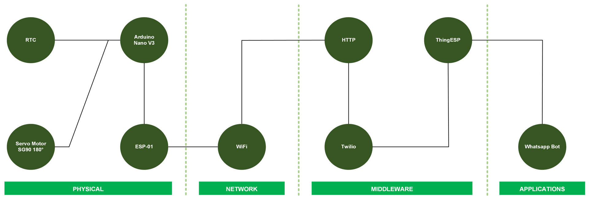
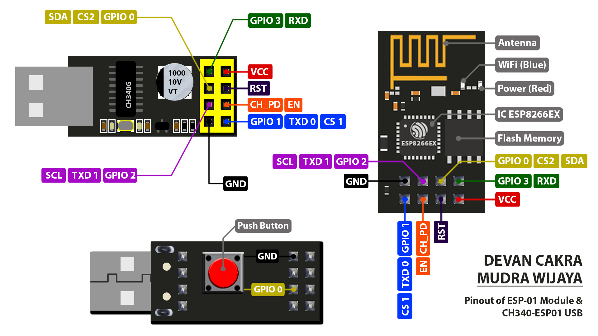

[](https://github.com/ellerbrock/open-source-badges/)
[](https://opensource.org/licenses/MIT)


# Whatsapp-Bot-based-Automatic-Fish-Monitoring-Feeding-System-using-I2C-communication-protocol
<strong>Solo Project: Whatsapp Bot-based Automatic Fish Monitoring & Feeding System using I2C communication protocol</strong><br><br>
Coming Soon...

<br><br>

## Project Requirements
| Part | Description |
| --- | --- |
| Development Board | • Arduino Nano V3<br>• ESP-01 |
| Code Editor | Visual Studio Code |
| Extensions | PlatformIO IDE |
| Programmer Tools | CH340-ESP01 USB |
| Driver | CH340 USB Driver |
| Application Support | Whatsapp Bot |
| IoT Platform | • Twilio<br>• ThingESP |
| Communications Protocol | • Inter Integrated Circuit (I2C)<br>• Hypertext Transfer Protocol (HTTP) |
| IoT Architecture | 4 Layer |
| Programming Language | C/C++ |
| Arduino Library | • Wire (default)<br>• ThingESP<br>• Servo<br>• RTClib |
| Actuators | Servo Motor SG90 180° (x1) |
| Sensor | RTC (x1) |
| Other Components | • Mini USB cable - USB type A (x1)<br>• Jumper cable (1 set)<br>• Fish feed servo casing (x1)<br>• Fish feed bottle (x1)<br>• Fish feed (1 set) |

<br><br>

## Download & Install
1. Visual Studio Code

   <table><tr><td width="810">
         
   ```
   https://bit.ly/VScode_Installer
   ```

   </td></tr></table><br>
   
2. CH340 USB Driver

   <table><tr><td width="810">
   
   ```
   https://bit.ly/CH340_USB_Driver
   ```
   
   </td></tr></table>
   
<br><br>

## Project Designs
<table>
<tr>
<th width="420">Block Diagram</th>
<th width="420">Infrastructure</th>
</tr>
<tr>
<td></td>
<td></td>
</tr>
</table>
<table>
<tr>
<th width="420">Pictorial Diagram</th>
<th width="420">Wiring</th>
</tr>
<tr>
<td></td>
<td></td>
</tr>
</table>

<br><br>

## Basic Knowledge
• <strong>Serial Communication</strong>

Basically, a device can be communicated with other devices either wirelessly or by cable. Communication between commonly used hardware is ``` Serial Communication ```. It can be known that there are three types of ``` Serial Communication ```, which include: ``` UART (Universal Asynchronous Receiver-Transmitter) ```, ``` SPI (Serial Peripheral Interface) ```, and ``` I2C (Inter Integrated Circuit) ```. ``` I2C (Inter Integrated Circuit) ``` is a two-way serial communication standard that uses two channels to send data ``` (OUTPUT from Master to Slave) ``` and receive data ``` (INPUT from Slave to Master) ```. I2C uses two bidirectional lines: ``` Serial Data (SDA) ``` and ``` Serial Clock (SCL) ``` to transfer data and synchronize communication between devices. Each device connected to the ``` I2C bus ``` has a unique address that identifies it during communication. The ``` I2C protocol ``` allows multiple devices to share the same bus, and each device can act as a ``` master ``` or a ``` slave ```. ``` Master ``` is the primary device that has full authority over the control of the Slave, while the ``` Slave ``` is the secondary device that is under the authority of the Master device.<br><br>

• <strong>Internet of Things</strong>

``` Internet of Things (IoT) ``` is a concept where things connected to a network can perform one or more actions in achieving a goal. These actions include data collection, data transmission, data reception, or data processing. Every IoT project requires devices that can connect to WiFi such as ESP. ESP consists of 2 types, namely ``` ESP8266 ``` and ``` ESP32 ```. This is on the market very diverse models, for that you need to readjust to the needs in the project so as not to cause disappointment.

<br><br>

## RTC Sensor Calibration
This RTC sensor can be calibrated using the following program code :

```ino
#include <RTClib.h> // Calling the RTC library
RTC_DS3231 rtc; // Constructor

void setup(){
   RTCinit(); // Calling the RTCinit method
}

void loop(){}

void RTCinit(){
   // Starting up the RTC
   rtc.begin();

   // DateTime Setting
   rtc.adjust(DateTime(F(__DATE__), F(__TIME__)));

   // Set Time Now
   rtc.adjust(DateTime(YYYY,MM,DD,HH,MM,SS)); // If you have calibrated please close with a comment
}
```

<br><br>

## Visual Studio Code Setup
Coming Soon...

<br><br>

## CH340-ESP01 USB Setup
<br><br><br>

1. ``` Programming Mode ``` :
      
   • Attach the ``` ESP-01 ``` to the ``` CH340-ESP01 USB ```.

   • Press and hold the button on the ``` CH340-ESP01 USB ```, and plug it into computer/laptop.
   
   • Release the button when the device is recognized by the computer/laptop.
   
   • Please ``` upload ``` the program.<br><br><br>
   
2. ``` Operating Mode ``` :
   
   • Release the ``` CH340-ESP01 USB ``` from the computer/laptop.
   
   • The program code that has been embedded in this ``` ESP-01 board ``` is ready for operation (no more programming activities).
   
   • Release the ``` ESP01 ``` from the ``` CH340-ESP01 USB ```. Do the wiring as shown in the pictorial diagram.<br><br><br>

<strong>Notes :</strong>

<table><tr><td width="840">
   
   • To upload the program, besides using the ``` CH340-ESP01 USB ```, you can also use other programming tools such as: ``` CP2102 USB ```, ``` CH340 USB ```, ``` FTDI USB ```, or with ``` PL2303 USB ```.

   • Based on experience, I admit that using the ``` CH340-ESP01 USB ``` is much better than other programming tools because it does not require a cable to be connected to a computer/laptop.

</td></tr></table><br><br>

## Twilio Setup
1. Getting started with Twilio :
   
   <table><tr><td width="810">
      
   • Go to the following url: <a href="https://www.twilio.com/">Click Here</a>.

   • Click ``` Log in ``` to access the service.

   • if you do not have an account, then click ``` Sign up ```.

   </td></tr></table><br>

2. Fill in all the required fields.<br><br>

3. Verify your ``` phone number ``` and ``` email ```.<br><br>

4. Access the ``` WhatsApp sandbox ``` in the ``` Settings ``` menu and ``` send the code ``` to the ``` provided WhatsApp number ```.
   
<br><br>

## ThingESP Setup
1. Getting started with ThingESP :
   
   <table><tr><td width="810">

   • Go to the following url: <a href="https://thingesp.siddhesh.me/#/">Click Here</a>.

   • Click ``` Login ``` to access the service.

   • if you do not have an account, then click ``` Create Account ```.

   </td></tr></table><br>

2. Fill in all required fields.<br><br>

3. Click ``` Project ``` in the sidebar -> then select ``` Add New Project ```.<br><br>

4. After the project has been created, enter the ``` Twilio WhatsApp Endpoint URL ``` into ``` ThingESP ``` to connect.
   
<br><br>

## Get Started
1. Download and extract this repository.<br><br>
   
2. Make sure you have the necessary electronic components.<br><br>
   
3. Make sure your components are designed according to the diagram.<br><br>
   
4. Configure your device according to the settings above.<br><br>

5. Please enjoy [Done].

<br><br>

## Demonstration of Application
Via Whatsapp: <a href="">AutoFish Bot</a>

<br><br>

## Highlights
<table>
<tr>
<th width="840">Device</th>
</tr>
<tr>
<td></td>
</tr>
</table>
<table>
<tr>
<th width="840" colspan="2">Whatsapp Bot</th>
</tr>
<tr>
<td width="420"></td>
<td width="420"></td>
</tr>
</table>

<br><br>

## Component Testing
You can download the component test file via the following link: <a href="Assets/Component Testing/Testing.txt">Click Here</a>

<br><br>

## Appreciation
If this work is useful to you, then support this work as a form of appreciation to the author by clicking the ``` ⭐Star ``` button at the top of the repository.

<br><br>

## Disclaimer
This application is my own work and is not the result of plagiarism from other people's research or work, except those related to third party services which include: libraries, frameworks, and so on.

<br><br>

## LICENSE
MIT License - Copyright © 2024 - Devan C. M. Wijaya, S.Kom

Permission is hereby granted without charge to any person obtaining a copy of this software and the software-related documentation files to deal in them without restriction, including without limitation the right to use, copy, modify, merge, publish, distribute, sublicense, and/or sell copies of the Software, and to permit persons receiving the Software to be furnished therewith on the following terms:

The above copyright notice and this permission notice must accompany all copies or substantial portions of the Software.

IN ANY EVENT, THE AUTHOR OR COPYRIGHT HOLDER HEREIN RETAINS FULL OWNERSHIP RIGHTS. THE SOFTWARE IS PROVIDED AS IS, WITHOUT WARRANTY OF ANY KIND, EITHER EXPRESS OR IMPLIED, THEREFORE IF ANY DAMAGE, LOSS, OR OTHERWISE ARISES FROM THE USE OR OTHER DEALINGS IN THE SOFTWARE, THE AUTHOR OR COPYRIGHT HOLDER SHALL NOT BE LIABLE, AS THE USE OF THE SOFTWARE IS NOT COMPELLED AT ALL, SO THE RISK IS YOUR OWN.
